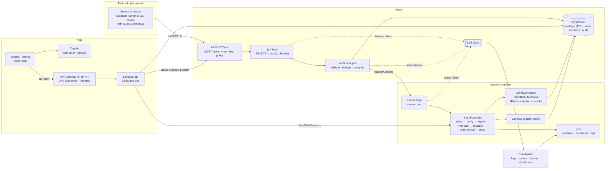

# Architecture

Single region (ap-south-1), fully serverless, defined in [backend/template.yaml](../backend/template.yaml). No VPC, NAT gateway, EC2 or always-on databases.

## Key design decisions

- **Deterministic decisions.** Level, hours remaining, leak detection, severity and the incident lifecycle are pure TypeScript in `packages/core`, shared by the Lambdas, the simulator and the web app, with 124 unit tests.
- **Identity comes from the topic, not the payload.** Each device certificate may publish only to `tanksaathi/v1/<channel>/<building>/<tank>/reading`, using registry attributes only an admin can set. Payloads that try to name a building are rejected by the strict schema.
- **Idempotency at every hop.** Readings are keyed by time and sequence; a DynamoDB transaction allows one open incident per tank; the workflow's first state claims the incident with a conditional write, so a duplicate EventBridge delivery exits quietly.
- **Humans in the loop with task tokens.** The workflow parks a token on the incident; the caretaker's Acknowledge and Resolve calls resume it. Unacknowledged alerts escalate after the building's limit (2 minutes for the demo building).
- **Authorization as policy.** Cedar decides who may view, act, plan refills or drive the simulator, per building. Each decision is logged with the policy that allowed it.
- **Cost guards.** Simulator runs are limited to one per 20 s and 60 a day; readings expire after 7 days; logs after 7 days; the API is throttled; there are no public unauthenticated write routes.
